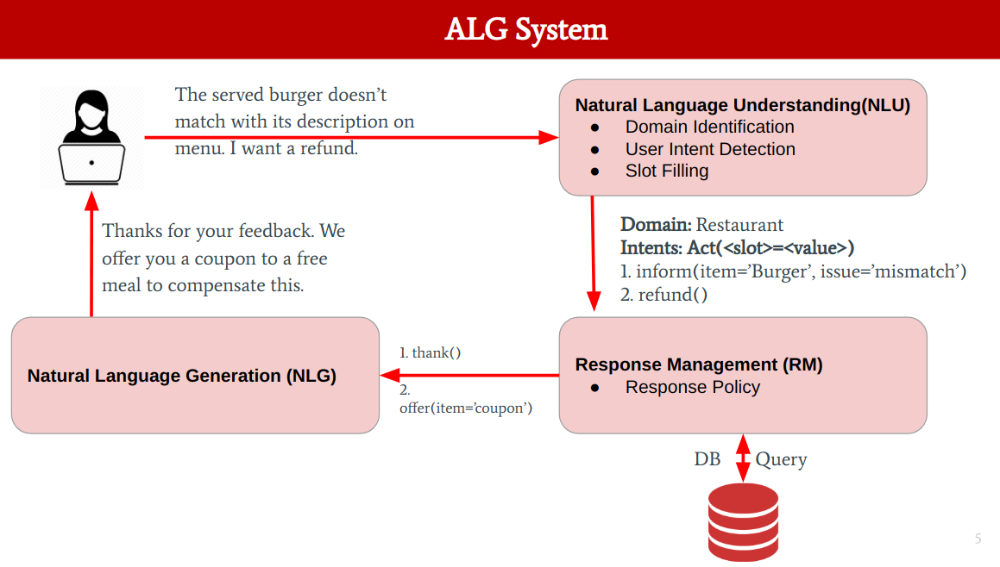

# ALG: Automatic Letter Generation

> **Objective:** *Given a customer Query/Complaint letter, LQ = {w1, w2, …, wN}, where wi is i-th word, the objective is to automatically generate template-based response letter LR.*

# Framework 

# Environment
Ubuntu20.04, python3.7.6

Install [pytorch 1.5.0](https://pytorch.org/)